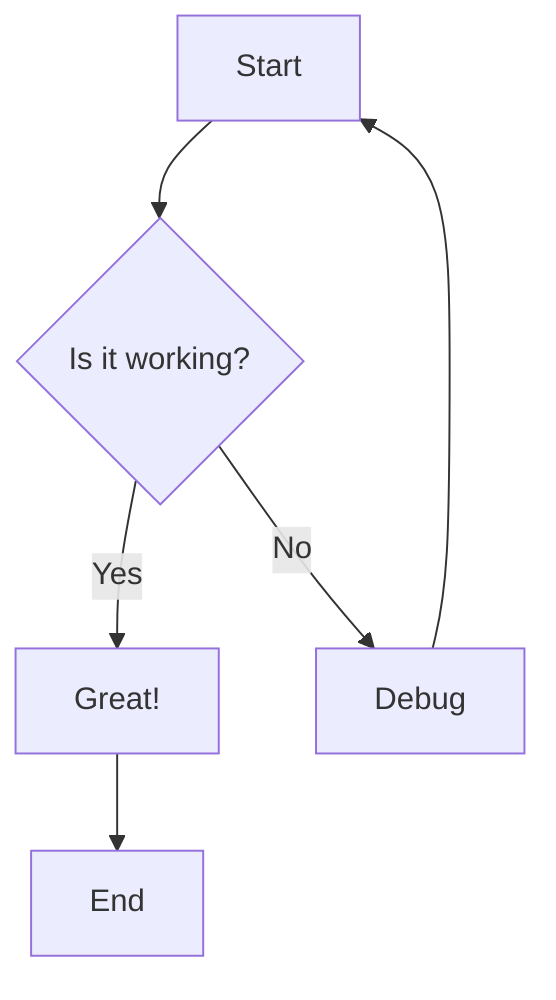

# MD Viewer v2.0.0 Test

This is a test of the new MD Viewer v2.0.0 with Mermaid diagram support.

## Simple Flowchart



## Basic Markdown Features

- **Bold text**
- *Italic text*
- `inline code`

### Code Block
```python
def hello_world():
    print("Hello from MD Viewer v2.0.0!")
```

This test verifies both basic markdown rendering and Mermaid diagram functionality.