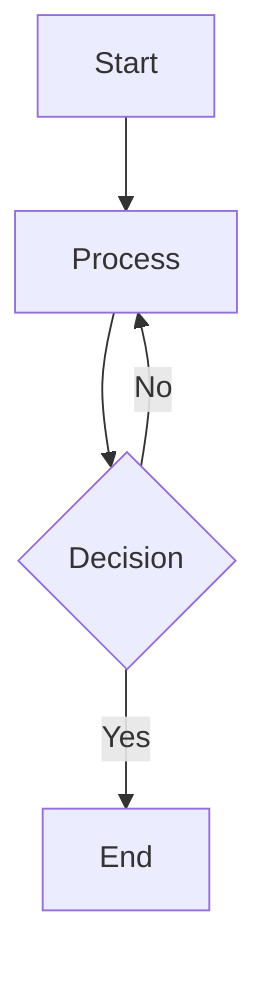

# GitHub Flavored Markdown (GFM) Test File

This file tests all GFM features to verify implementation completeness.

## 1. Headings

### ATX Style Headings (with #)

# Heading 1
## Heading 2
### Heading 3
#### Heading 4
##### Heading 5
###### Heading 6

### Setext Style Headings (underline)

Setext Heading 1
================

Setext Heading 2
----------------

## 2. Emphasis

**Bold text with asterisks**
__Bold text with underscores__

*Italic text with asterisks*
_Italic text with underscores_

***Bold and italic***
___Bold and italic___

## 3. Strikethrough

~~This text should have a strikethrough~~

~~This is **bold** and strikethrough~~

## 4. Lists

### Unordered Lists

- Item 1
- Item 2
  - Nested item 2.1
  - Nested item 2.2
- Item 3

* Alternative bullet
+ Another alternative

### Ordered Lists

1. First item
2. Second item
   1. Nested item
   2. Another nested item
3. Third item

### Task Lists

- [x] Completed task
- [ ] Incomplete task
- [x] Another completed task
  - [ ] Nested incomplete task
  - [x] Nested completed task

## 5. Code

### Inline Code

Use `inline code` with single backticks.

Use ``code with `backticks` inside`` with double backticks.

### Fenced Code Blocks with Backticks

```javascript
function hello() {
  console.log("Hello, world!");
}
```

```python
def greet(name):
    print(f"Hello, {name}!")
```

### Fenced Code Blocks with Tildes

~~~ruby
def factorial(n)
  n <= 1 ? 1 : n * factorial(n - 1)
end
~~~

### Indented Code Blocks

    This is an indented code block
    Created with 4 spaces
    Each line is indented

## 6. Links

### Inline Links

[GitHub](https://github.com)
[Link with title](https://example.com "Example Title")

### Reference Links

[Reference link][ref]
[Another reference][another-ref]

[ref]: https://github.com "GitHub"
[another-ref]: https://example.com

### Autolinks (Standard)

<https://www.github.com>
<user@example.com>

### Autolinks (Extended/GFM)

https://www.github.com
www.example.com
user@example.com

## 7. Images


## 8. Block Quotes

> This is a block quote.
> It can span multiple lines.

> Nested quotes:
> > This is nested
> > > And this is even deeper

> Block quote with **bold** and *italic*

## 9. Horizontal Rules (Thematic Breaks)

---

***

___

## 10. Tables

| Header 1 | Header 2 | Header 3 |
|----------|----------|----------|
| Cell 1   | Cell 2   | Cell 3   |
| Cell 4   | Cell 5   | Cell 6   |

### Tables with Alignment

| Left Aligned | Center Aligned | Right Aligned |
|:-------------|:--------------:|--------------:|
| Left         | Center         | Right         |
| Text         | Text           | Text          |

## 11. HTML

### Inline HTML

This is <span style="color: red;">red text</span> using inline HTML.

### HTML Block

<div style="background-color: #f0f0f0; padding: 10px; border-radius: 5px;">
This is an HTML block with custom styling.
</div>

<details>
<summary>Click to expand</summary>
This content is hidden by default.
</details>

## 12. Backslash Escapes

\* Not italic \*
\_ Not italic \_
\# Not a heading
\[Not a link\]
\`Not code\`

## 13. Line Breaks

### Hard Line Breaks (two spaces at end)

Line 1 with two spaces
Line 2 should be on a new line

Line 1 with backslash\
Line 2 should be on a new line

### Soft Line Breaks

This is a paragraph
with soft line breaks
that should be joined together.

## 14. Entity and Numeric References

&copy; Copyright symbol
&lt; Less than
&gt; Greater than
&amp; Ampersand
&quot; Quote mark

&#169; Copyright (numeric)
&#8364; Euro sign

## 15. Nested Block Quotes

> Level 1
> > Level 2
> > > Level 3
> > > > Level 4

## 16. Mixed Content

Here's a paragraph with **bold**, *italic*, ~~strikethrough~~, and `inline code`.

You can also have [links](https://github.com) and  inline.

### Complex List

1. First item with **bold**
2. Second item with *italic*
   - Nested unordered item
   - Another with `code`
3. Third item with ~~strikethrough~~

## 17. Code with Syntax Highlighting

```bash
#!/bin/bash
echo "Testing syntax highlighting"
```

```json
{
  "name": "test",
  "version": "1.0.0"
}
```

## 18. Mermaid Diagrams (GFM Extension)



---

## End of GFM Test File

This file covers all major GitHub Flavored Markdown features.
